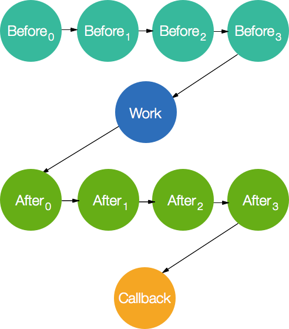

# Understudy

A means to provide interceptors (i.e. hooks) when performing asynchronous actions.

* **All hooks are asynchronous**
* * All logic done by `perform`-based actions is asynchronous.
* * Error first helpers.
* * Fail fast.
* **Consistency in arguments provided to hooks & actions**
* * Hooks can only mutate arguments that they are passed, not the number of arguments.
* * Use of callback arguments to pass information removes focus on return values to mitigate this potentially odd behavior.
* **Opt-in behavior.**
* * Only calls to `.perform(action ...` enable hooking.



By depending on `understudy` you are exposed to four methods: `perform`, `before`, `after` and `waterfall`

#### `.perform(action, arg0, /* arg1, ... */, work, callback)`

This is the core API for invoking hooks provided by `Understudy`. Each call to `perform` for the same `action` should have a consistent argument signature because this is what will be expected by each of the before and after hooks for the `action`. The overall flow control is:

1. Call all `before` hooks for `action`.
2. Call `work` function for `action`.
3. Call all `after hooks for `action`.
4. Call `callback` with results from `work` function.

#### `.before(action, arg0, /* arg1, ... */, next)`

Called before the `work` function is executed in perform with _exactly_ the arguments passed to `.perform`. Nothing passed to `next` have an impact on the flow control above **except any error is supplied short-circuits execution to the callback.**

#### `.after(action, arg0, /* arg1, ... */, next)`

Called after the `work` function is executed in perform with _exactly_ the
arguments passed to `.perform`. Nothing passed to `next` have an impact on the
flow control above **except any error is supplied short-circuits execution to
the callback.** 

While the above statement is true when using `.perform`, `after` hooks acquire a
`waterfall` like behavior with `.waterfall` where the result of work function
gets passed to the `after` hooks. Each after hook is then able to mutate the
arguments passed to the next one. Strongly discouraged to change number of
arguments for your user's sanity.

#### `.waterfall(action, arg0, /* arg1, ... */, work, callback)`

This is a slightly different `perform` that is very useful for when you have to
modify state received from a function in a sequence of configurable hooks.

1. Call all `before` hooks for `action`.
2. Call `work` function for `action`.
3. Call all `after hooks for `action` with the result returned from the `work`
   function.
4. Call `callback` with results from the `after` hooks execution (if any) and
   otherwise the results from the `work` function.


## Real-world Usage

Let's consider a real-world application with two interceptable actions:

- `start`: Application has started
- `http:request`: Application has received an incoming HTTP request.

We could easily implement this `App` behavior in `Understudy`:

``` js
var Understudy = require('understudy');

var App = module.exports = function App() {
  Understudy.call(this);
};

//
// Starts the application after running before and
// after hooks.
//
App.prototype.start = function (options, callback) {
  this.perform('start', options, function (next) {
    //
    // Here, `options` may have been mutated from the execution
    // of the before hooks.
    // ...
    // Do some other async thing
    // ...
    // These arguments are passed to the final callback unless
    // short-circuited by an error here, or in an after hook.
    //
    next(null, options);
  }, callback);
};

App.prototype.handle = function (req, res) {
  req.times = {
    start: process.hrtime()
  };

  this.perform('http:request', req, res, function (next) {
    req.times.middle = process.hrtime();
    req.times.begin  = process.hrtime(req.times.start);
    next();
  }, function (err) {
    if (err) {
      //
      // Do some error handling.
      //
    }

    req.times.total = process.hrtime(req.times.start);
    req.times.after = process.hrtime(req.times.middle);
    console.log([
      'Total time: %s',
      '  Before hooks: %s',
      '  After  hooks: %s'
    ].join('\n'), format(req.times.total), format(req.times.begin), format(req.times.after));

    res.end();
  });
}

//
// Now we consume a new app with hooks.
//
var http = require('http');

var app = new App();
app.before('start', function (options, next) {
  var server = options.server = http.createServer(function (req, res) {
    app.handle(req, res);
  });

  server.listen(options.port, next);
});

app.after('start', function (options, next) {
  console.log('App started on %s', options.port);
});

app.before('http:request', function (req, res, next) {
  //
  // Do something asynchronous.
  //
  next();
});

app.start({ port: 8080 }, function () {
  console.log('ok');
});

//
// Format process.hrtime()
//
function format(s) {
  return (s[0] * 1e3 + s[1] / 1e6) / 1e3;
}
```

## More Examples

See [the example directory](/example)

### Error handling when **no callback is provided**

Each `before` and `after` hook can provide an optional error to short-circuit evaluation of the flow that would normally follow it. This error will be provided to your `callback`, when supplied. In the event that you DO NOT provide a `callback` and a `before`, `after` or `work` function responds with an `Error` _IT WILL BE IGNORED AND FLOW WILL CONTINUE._ e.g.

``` js
var Understudy = require('understudy');
var actor = new Understudy();

actor.before('always', function (next) {
  next(new Error('I always fail'));
});

actor.after('always', function (next) {
  console.log('I always get called. NO MATTER WHAT');
  console.log('BUT, only when no callback is supplied.');
  next(new Error('Another swallowed error'));
});

actor.perform('always', function (done) {
  done(new Error('Errors are ignored here too.'));
});
```

In other words (as in the above example): if you do not supply a callback to your `.perform` then `understudy` will consider all of your `before`, `after` and `work` functions as **"fire and forget".**

##### LICENSE: MIT
##### Author: [Bradley Meck](https://github.com/bmeck)
##### Contributors: [Jarrett Cruger](https://github.com/jcrugzz), [Charlie Robbins](https://github.com/indexzero)
